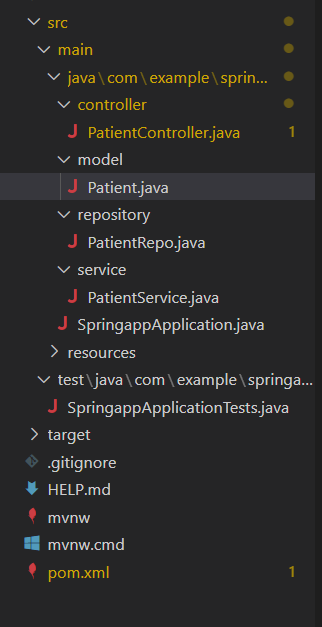

# Project Question

## Overview:

Build a web application that facilitates POST and GET operations for managing patient details via RESTful APIs.


## Functional Requirements:    

Create folders named as controller,model,repository and service inside the `WORKSPACE/springapp/src/main/java/com/example/springapp`.

- Inside the controller folder, create a class named **“PatientController”**

- Inside the model folder, create a class named **"Patient"**  with the following attributes:

    ```
    patientId - int
    patientName - String 
    doctorName  - String 
    disease -  String 
    medication - String 
    ```

- Implement getters, setters and constructors for the corresponding attributes.

- Inside repository folder, create a interface name **"PatientRepo"**.

- Inside service folder, create a class file name **"PatientService"**.


Refer the below image for the project structure:




## API Endpoint :

1. `POST - /api/patient` - returns response status 201 with patient object on successful creation or else 500. 

2. `GET - /api/patient` - returns response status 200 with List <Patient > object on successful retrieval or else 404.

3. `GET - /api/patient/{patientId}` - returns response status 200 with patient object on successful retrieval or else 404.


### Note:

Do not modify the `application.properties` and `pom.xml` files. If you change there may be build failure and the test case will fail. Follow the naming convention as specified above.


## API endpoint:

8080

## Platform Guidelines:

To run the project use Terminal in the platform.


## Spring Boot:

Navigate to the springapp directory => `cd springapp`

To start/run the application `'mvn spring-boot:run'`


### To Connect the Database Open the terminal

```sh
mysql -u root --protocol=tcp -p
password:examly
```


**Note: Drop database before running test case**


Click on the Run Test Case button to pass all the test cases
